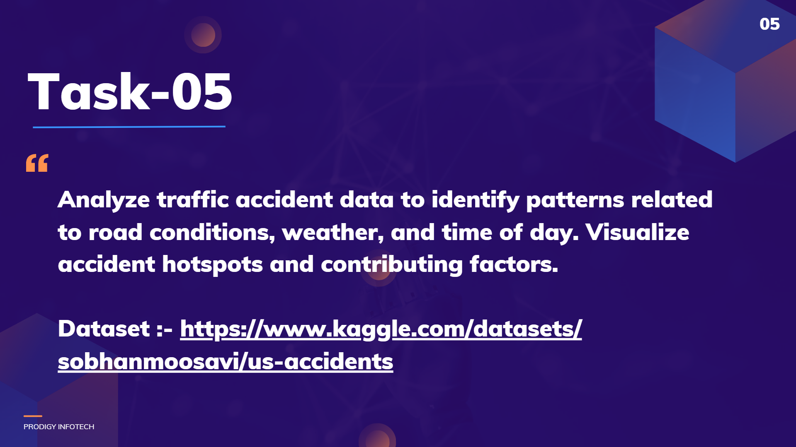

# **PRODIGY_DS_05**  
## Prodigy InfoTech – Data Science Internship (Task 5)  

  

Hi there!  
I'm **RITHIK CA**, and this repository contains my submission for **Task 5** of the **Prodigy InfoTech Data Science Internship**. In this task, I analyzed **Traffic Accident Data** to identify **patterns related to road conditions, weather conditions, and time of day**, and visualized accident hotspots and contributing factors.  

---

## 📋 Problem Statement  
The objective of this task is to **analyze traffic accident data** to uncover trends and patterns related to **environmental factors (weather, road)** and **temporal factors (time of day)**.  
The analysis aims to answer:  
- Which conditions lead to the **highest number of accidents**?  
- What **time of day** is most accident-prone?  
- Are there specific **road/weather combinations** that increase risk?  

---

## 🌍 About the Dataset  
The dataset contains historical accident records with multiple features, such as:  
- **Date & Time** of the accident  
- **Weather conditions** (Clear, Rain, Snow, Fog, etc.)  
- **Road surface conditions** (Dry, Wet, Snow-covered, etc.)  
- **Accident severity** and location details  

*(Dataset provided for educational purposes.)*  

---

## 🛠 Tools & Libraries  
- **Python (Jupyter Notebook)**  
- `pandas`, `numpy` – Data cleaning and manipulation  
- `matplotlib`, `seaborn` – Data visualization  
- `folium` – Accident hotspot mapping (interactive map)  

---

## 🔍 Workflow Overview  

### 1. Data Exploration  
- Loaded and reviewed dataset structure  
- Handled missing and inconsistent data  
- Checked distributions of key variables  

### 2. Data Cleaning & Preprocessing  
- Converted **date and time** fields into proper formats  
- Created additional features (e.g., hour of the day)  
- Handled categorical data for analysis  

### 3. Exploratory Data Analysis (EDA)  
- Accident frequency by **time of day** (hourly and daily patterns)  
- Correlation between **weather conditions** and **accident severity**  
- Effect of **road conditions** on accident likelihood  

### 4. Visualization  
- **Bar Charts:** Accidents by time, weather, and road conditions  
- **Heatmaps:** Correlation of numerical variables  
- **Accident Hotspot Map:** Using **Folium** for geospatial visualization  

---

## 💡 Key Insights  
- **Peak accident hours:** Early morning rush and evening commute  
- **Weather factor:** Rain and fog conditions showed higher accident severity  
- **Road factor:** Wet and icy roads contributed significantly to accidents  
- Hotspot analysis revealed **specific regions with higher accident density**  

---

## 📊 Visualizations  
- **Time vs Accident Frequency (Line Plot)**  
- **Weather Impact (Bar Chart)**  
- **Road Condition Analysis (Stacked Chart)**  
- **Interactive Hotspot Map (Folium)**  

*(All visualizations are available in the Jupyter Notebook.)*  

---

## 🎯 Conclusion  
This analysis demonstrates how **data-driven insights** can help authorities and transport planners improve **road safety** by identifying risk factors and high-risk conditions.  
Such studies can guide **preventive measures**, **traffic regulations**, and **resource allocation** for emergency services.  

---

**Thank you for visiting!** 😊  
For questions or suggestions, feel free to open an issue or connect with me.  

🔗 **GitHub Repository:** [Add your link here]  
